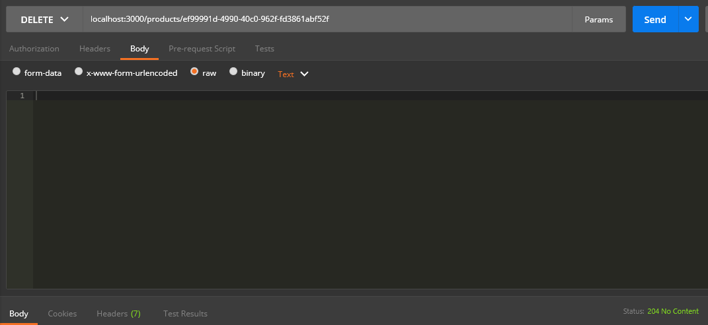

# 5HDS-M2 : Maxence Berger

## Installation du projet 

Clonez le projet avec la commande suivante
```
git clone https://github.com/MaxenceBerger/5HDS-M2.git
```
Exécutez dans votre terminal
```
npm install
```
## Lancer le projet

Exécutez dans votre terminal
```
npm start
```
Si vous avez le message **Server listening on port 3000** dans votre terminal, c'est que l'API est bien lancé.

Allez dans [http://localhost:3000/](http://localhost:3000/), vous allez voir **5hds project works**

## Tests des routes
### Gestion utilisateurs :
- Ajouter un utilisateur

> ROUTE : POST localhost:3000/users


- Modifier une fiche utilisateur

> ROUTE : PUT localhost:3000/users/:id


- Supprimer une fiche utilisateur

> ROUTE : DELETE localhost:3000/users/:id


- Lister les utilisateurs

> ROUTE : GET localhost:3000/users


### Gestion produits :
- Ajouter un produit

> ROUTE : POST localhost:3000/products


- Modifier une fiche produit

> ROUTE : PUT localhost:3000/products/:id


- Supprimer une fiche produit

> ROUTE : DELETE localhost:3000/products/:id


- Lister les produits

> ROUTE : GET localhost:3000/products
